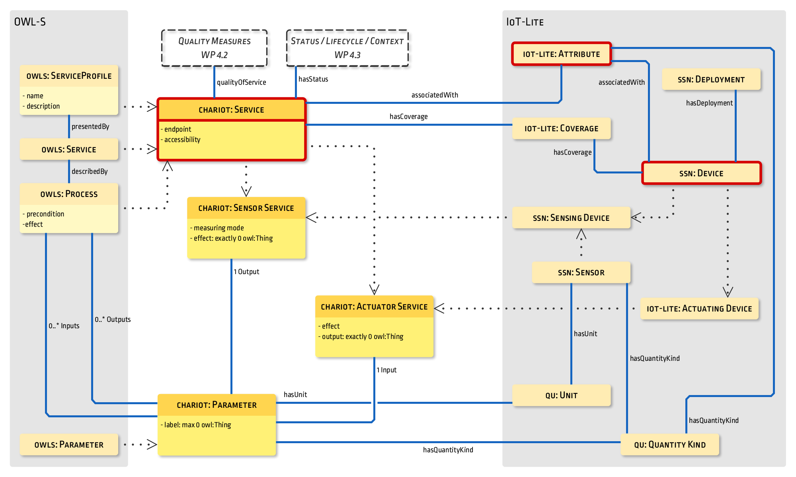

## Semantic Services & Data

This project contains semantic descriptions as well as other semantic-related components for the CHARIOT project.

## Ontologies

In [com.gtarc.chariot.ontologies](]com.gtarc.chariot.ontologies) you can find the ontologies.

### Functional Description of Semantic Services & Devices

Link: [com.gtarc.chariot.ontologies/iot-services/iot-services.owl](com.gtarc.chariot.ontologies/iot-services/iot-services.owl)

### Ontology Repository

The ontologies are also accessible online: [CHARIOT Ontology Repository](http://chariot.aot.tu-berlin.de/ontologies/)

## Contributors

Christian Kuster - [christian.kuster@gt-arc.com](mailto:christian.kuster@gt-arc.com)# iot_ontology
